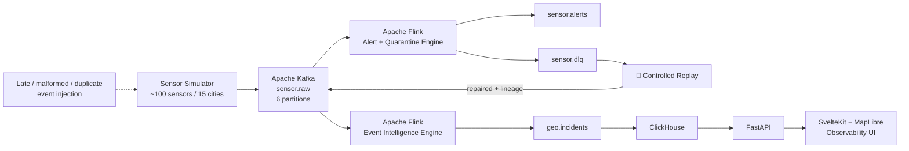
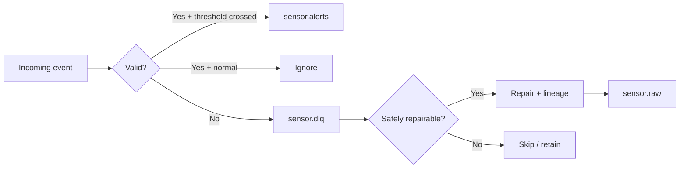

<div align="center">

# GEOFlux

### Real-Time Global Event Intelligence Stream

**A 3-day hands-on exploration of modern streaming data engineering**

`Kafka` · `Apache Flink` · `ClickHouse` · `FastAPI` · `SvelteKit` · `MapLibre` · `Docker`

<br>

**~100 virtual sensors · 15 cities · 4 sensor domains · 6 Kafka partitions · 2 concurrent Flink jobs**

</div>

---

## What is GEOFlux?

GEOFlux is a compact distributed streaming laboratory built to explore what happens to data **after it stops behaving perfectly**.

Instead of treating Kafka and Flink as boxes in an architecture diagram, the project generates a continuous global sensor stream and deliberately injects disorder: late events, malformed records, missing fields, invalid values and duplicates.

The system then processes those events through Kafka and Apache Flink, persists incidents into ClickHouse, exposes operational state through FastAPI, and provides a SvelteKit/MapLibre interface for inspecting the running pipeline.

> **The central question was not only “Can the system process streaming events?” but “What happens to an event when something goes wrong?”**

---

## Project Scope

This repository is intentionally a **three-day data-engineering tools exploration**, not a production platform and not primarily a data-analytics project.

The objective was to learn by building and breaking a real streaming pipeline:

- partitioned event ingestion
- independent consumer workloads
- event time and processing time
- watermarks and out-of-order events
- tumbling event-time windows
- validation and data contracts
- dead-letter queues
- controlled replay and lineage
- at-least-once delivery semantics
- streaming persistence
- runtime observability

---

## Architecture



### Streaming topology

```text
Sensor Simulator
       │
       ▼
  sensor.raw (Kafka)
       │
       ├─────────────────────────────┐
       ▼                             ▼
Alert + Quarantine Flink       Event-Time Flink
       │                             │
   ┌───┴────┐                  geo.incidents
   ▼        ▼                        │
alerts   sensor.dlq                  ▼
            │                    ClickHouse
            ▼                        │
      controlled replay              ▼
            │                     FastAPI
            └──────► sensor.raw       │
                                     ▼
                              Observability UI
```

---

## The Event Stream

The simulator models approximately **100 virtual sensors across 15 cities**.

| Sensor domain | Example measurement | Streaming concern |
|---|---|---|
| Seismic | seismic activity | threshold + clustering |
| Weather | temperature | extreme-event windows |
| Air quality | pollution reading | threshold + clustering |
| Power | grid frequency | deviation detection |

Every event carries identifiers, sensor metadata, location, event and ingest timestamps, measurement value, unit and status.

The simulator also deliberately injects failure conditions:

```text
normal event ───────────────► processing
late event ─────────────────► watermark experiment
duplicate event ────────────► delivery/idempotency exploration
missing field ──────────────► validation ─► DLQ
invalid value ──────────────► validation ─► DLQ
malformed event ────────────► validation ─► DLQ
```

---

## Kafka: The Event Backbone

The primary stream is:

```text
sensor.raw
```

with **6 partitions**.

Kafka is used to explore:

- topics and partitions
- offsets
- consumer groups
- independent consumers
- replayable logs
- downstream decoupling
- consumer lag and observability

Important downstream topics include:

| Topic | Purpose |
|---|---|
| `sensor.raw` | raw sensor event stream |
| `sensor.alerts` | record-level threshold alerts |
| `sensor.dlq` | quarantined invalid events |
| `geo.incidents` | event-time/window-generated incidents |

---

## Flink: Stateful Stream Processing

Two Flink jobs run concurrently.

### 1. GEOFlux Event Intelligence Engine

Responsible for event-time processing.

It explores:

- event timestamps
- bounded out-of-orderness
- **5-second watermarks**
- keyed streams
- tumbling event-time windows
- aggregate incident generation

Example incident classes include:

`SEISMIC_CLUSTER` · `EXTREME_HEAT_CLUSTER` · `AIR_QUALITY_CLUSTER` · `POWER_INSTABILITY`

### 2. GEOFlux Alert + Quarantine Engine

Responsible for record-level validation and routing.



A valid but ordinary event is **not** treated as bad data. A contract-violating event is quarantined rather than silently disappearing.

---

## Dead-Letter Queue & Controlled Replay

The DLQ experiment became one of the most useful parts of GEOFlux.

Failed records retain context such as:

```json
{
  "failure_reason": "MISSING_REQUIRED_FIELD",
  "failed_field": "sensor_id",
  "failed_stage": "validation",
  "source_topic": "sensor.raw",
  "pipeline_version": "alert-engine-v2",
  "replay_count": 0
}
```

The replay utility distinguishes between failures that can be repaired safely and failures where a repair would fabricate source data.

| Failure | Decision |
|---|---|
| Missing `sensor_id` | Controlled repair + replay |
| Missing measurement value | Skip |
| Invalid measurement value | Skip |

Replayed records receive lineage metadata and return to `sensor.raw`. A bounded replay policy prevents a poison event from circulating indefinitely.

---

## Streaming Persistence with ClickHouse

Processed incidents flow from Kafka into ClickHouse for persistent storage and fast querying.

During the final experimental run:

<div align="center">

### **44,891 incidents persisted**

</div>

The project also uses a city dimension table to enrich incident data with geographical coordinates used by the serving layer.

---

## Serving & Observability

FastAPI exposes the state of the processed stream to the frontend.

The API supports views including:

- incident summary
- recent/live incidents
- incident timeline
- geographical incident data
- city drill-down
- system health
- streaming throughput
- Kafka lag/consumer information

SvelteKit and MapLibre provide an operational inspection surface for the pipeline. The frontend is intentionally **secondary to the streaming system**: it exists to make the behavior of the infrastructure visible.

---

## Experimental Results

<div align="center">

| Final observation | Result |
|---|---:|
| Incidents persisted | **44,891** |
| Concurrent Flink jobs | **2 RUNNING** |
| `sensor.raw` partitions | **6** |
| Simulated cities | **15** |
| Sensor domains | **4** |
| DLQ quarantine | **PASS** |
| Controlled replay | **PASS** |

</div>

The experiment successfully demonstrated event-time processing, late-event tolerance, malformed-event quarantine, selective repair, replay lineage, concurrent stream processors and persistent streaming ingestion.

### Full experimental evidence

The detailed experiment report—including results images, DLQ evidence, replay results and engineering observations—is maintained separately:

### ➜ **[View the full GEOFlux Experimental Results](results/RESULTS.md)**

---

## Technology Stack

| Layer | Technology | What I explored |
|---|---|---|
| Event generation | **Python** | synthetic streaming + failure injection |
| Event backbone | **Apache Kafka 4.1** | partitions, offsets, groups, replay |
| Stream processing | **Apache Flink / PyFlink 1.20** | event time, watermarks, windows, routing |
| Persistence | **ClickHouse** | streaming ingestion + analytical event storage |
| API | **FastAPI** | serving processed stream state |
| Frontend | **SvelteKit / Svelte 5** | lightweight observability interface |
| Mapping | **MapLibre GL JS** | live geographical inspection |
| Visualization | **Apache ECharts** | operational stream metrics |
| Runtime | **Docker Compose** | reproducible local infrastructure |

---

## Repository Structure

```text
geoflux/
│
├── producers/
│   └── sensor_simulator.py
│
├── streaming/
│   ├── sensor_pipeline.py
│   └── window_pipeline.py
│
├── tools/
│   └── replay_dlq.py
│
├── backend/
│   ├── main.py
│   └── database.py
│
├── frontend/
│   └── src/
│
├── results/
│   ├── RESULTS.md
│   └── images/
│
├── connectors/
├── docker-compose.yml
└── README.md
```

---

## Running GEOFlux

### 1. Start infrastructure

```powershell
docker compose up -d
docker ps
```

### 2. Verify the Flink scripts mounted into the JobManager

```powershell
docker exec geoflux-flink-jobmanager ls -lah /opt/flink/usrlib
```

### 3. Submit the alert/quarantine pipeline

```powershell
docker exec geoflux-flink-jobmanager /opt/flink/bin/flink run -d `
  -py /opt/flink/usrlib/sensor_pipeline.py `
  --jarfile /opt/flink/lib/flink-sql-connector-kafka-3.3.0-1.20.jar
```

### 4. Submit the event-time intelligence pipeline

```powershell
docker exec geoflux-flink-jobmanager /opt/flink/bin/flink run -d `
  -py /opt/flink/usrlib/window_pipeline.py `
  --jarfile /opt/flink/lib/flink-sql-connector-kafka-3.3.0-1.20.jar
```

### 5. Start the sensor simulator

```powershell
cd producers
python sensor_simulator.py
```

### 6. Start FastAPI

```powershell
cd backend
python -m uvicorn main:app --reload
```

### 7. Start the SvelteKit frontend

```powershell
cd frontend
npm run dev
```

### Local services

| Service | Address |
|---|---|
| Flink Dashboard | `http://localhost:8081` |
| FastAPI | `http://127.0.0.1:8000` |
| GEOFlux UI | `http://localhost:5173` |

---

## A Few Useful Experiments

### Inspect the DLQ

```powershell
docker exec geoflux-kafka /opt/kafka/bin/kafka-console-consumer.sh `
  --bootstrap-server kafka:29092 `
  --topic sensor.dlq `
  --from-beginning `
  --max-messages 10
```

### Run controlled replay

```powershell
python tools\replay_dlq.py
```

### Inspect running Flink jobs

```powershell
docker exec geoflux-flink-jobmanager /opt/flink/bin/flink list
```

### Inspect Kafka consumer groups

```powershell
docker exec geoflux-kafka /opt/kafka/bin/kafka-consumer-groups.sh `
  --bootstrap-server kafka:29092 `
  --list
```

---

## What I Learned

The most important lesson was that a streaming architecture is not defined only by its happy path.

A useful pipeline has to answer harder questions:

**What happens when an event is late?**  
Use event time and watermarks deliberately.

**What happens when a producer violates the contract?**  
Quarantine the event with enough context to investigate it.

**What happens when the data can be repaired?**  
Replay it while preserving lineage.

**What happens when it cannot be repaired safely?**  
Do not fabricate source data simply to make the pipeline succeed.

**What does at-least-once actually mean?**  
Delivery guarantees and business-level idempotency are different problems.

**Can configuration be trusted as observability?**  
No. During the final run, expected Flink consumer-group identifiers were not visible through Kafka's consumer-group inspection. Runtime state must be measured rather than assumed.

---

## Deliberate Limitations

GEOFlux is an exploration project, not a production streaming platform.

The three-day scope deliberately stopped before implementing:

- full exactly-once business semantics
- production schema registry / schema evolution
- production-grade authentication and authorization
- multi-node Kafka/Flink deployment
- comprehensive stateful deduplication
- production monitoring/alerting
- cloud deployment
- formal load testing and capacity planning

These are natural extensions, but adding them would change the purpose of this project from a focused tools exploration into a production-engineering exercise.

---

## Final Takeaway

<div align="center">

### Data engineering gets interesting when the data stops behaving perfectly.

**Late data · malformed events · partitioning · watermarks · DLQs · replay · lineage · delivery semantics**

GEOFlux was built to explore those behaviors end-to-end.

</div>

---

<div align="center">

**Built as a 3-day real-time data engineering exploration.**

[Experimental Results](results/RESULTS.md)

</div>
