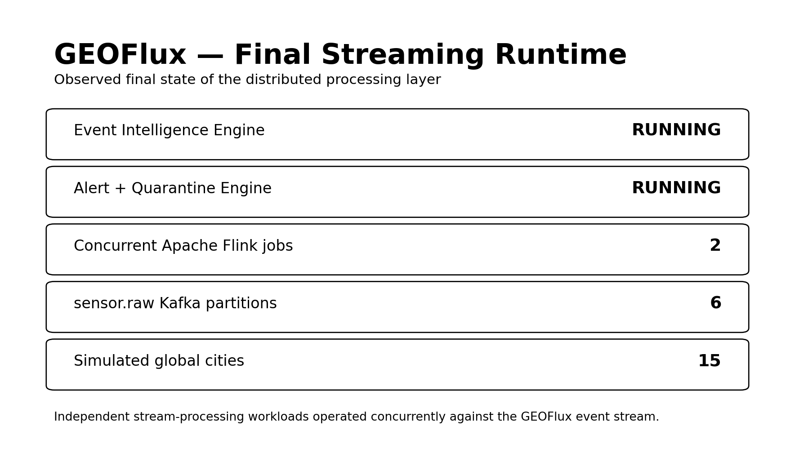
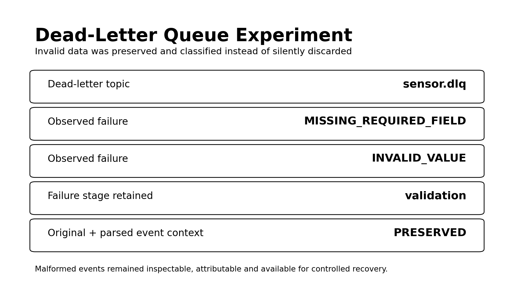
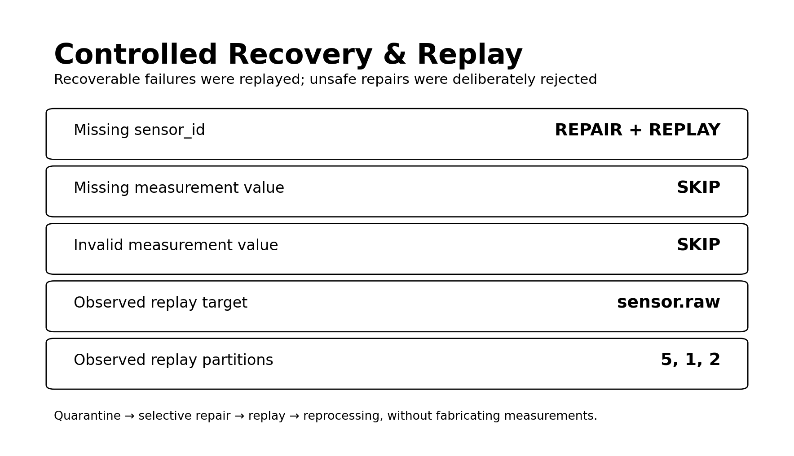
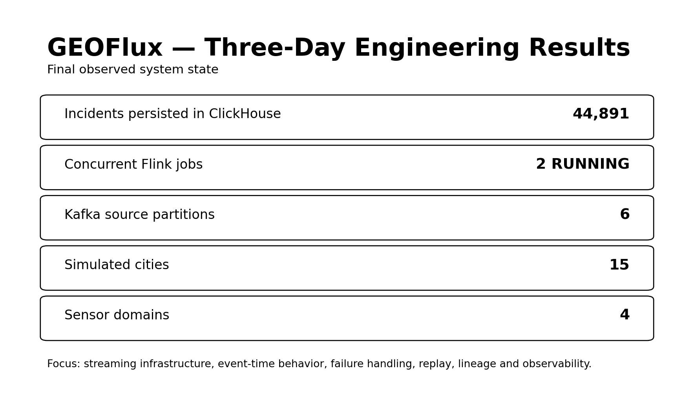

# GEOFlux Experimental Results

GEOFlux was built as a **three-day hands-on exploration of real-time data engineering systems**, not as a conventional data analytics project. The experiment focused on how a distributed event pipeline behaves when data arrives continuously, arrives late, violates its expected structure, contains invalid values, or requires recovery after failure.

## 1. Final Runtime State

Two independent Apache Flink pipelines were successfully operated against the event stream:

- **GEOFlux Event Intelligence Engine** — event-time window processing and incident generation.
- **GEOFlux Alert + Quarantine Engine** — record validation, alert generation, and dead-letter routing.

Both jobs were observed in the `RUNNING` state during the final experiment.

The primary Kafka topic, `sensor.raw`, used **6 partitions**. The simulator represented approximately **100 virtual sensors across 15 global cities** and four sensor domains: seismic, weather, air quality, and electrical power.

## 2. Event-Time Processing and Disorder

GEOFlux deliberately introduced late and out-of-order events rather than assuming perfectly ordered input. Apache Flink processed the stream using event time with a bounded-out-of-orderness watermark of **5 seconds**.

Tumbling event-time windows were used to detect clusters including seismic activity, extreme heat, poor air quality, and power instability.

The experiment demonstrated a central streaming principle: **the time at which an event occurred is not necessarily the time at which the processing system receives it.**

## 3. Failure Injection and Data Validation

The simulator intentionally generated imperfect data, including missing required fields, invalid measurement values, malformed events, duplicates, and late events.

The validation pipeline distinguished between a **valid event that did not require an alert** and an **invalid event that violated the expected data contract**. Invalid events were not silently discarded; they were quarantined in `sensor.dlq`.

Each quarantined record retained diagnostic and lineage context including the failure reason, failed field, processing stage, failure timestamp, source topic, pipeline version, replay count, original raw event, and parsed event where available.

Observed validation failures included `MISSING_REQUIRED_FIELD` and `INVALID_VALUE`.

## 4. Controlled Recovery and Replay

A separate replay utility consumed quarantined records from `sensor.dlq`. The utility intentionally did **not** attempt to repair every failed event.

A missing sensor identifier could be repaired using a controlled fallback identifier. Missing or invalid measurement values were rejected because fabricating a sensor measurement would alter the meaning of the source data.

During the experiment, repaired events were successfully republished to `sensor.raw`. Observed successful replay output included partitions **5, 1, and 2**, while unsafe repairs such as missing or invalid measurement values were skipped.

Replay lineage metadata was attached to recovered events, and a bounded replay policy was introduced to reduce the risk of poison records circulating indefinitely.

The completed failure lifecycle was:

**ingestion → validation → quarantine → inspection → selective repair → replay → reprocessing**

## 5. Streaming Persistence

Processed incidents were continuously persisted into ClickHouse. At the time of the final experiment, the `incidents` table contained:

## **44,891 incident records**

This verified persistent downstream ingestion from the Kafka/Flink streaming pipeline into the event store.

ClickHouse was used as the persistence and query layer rather than as the primary stream-processing engine.

## 6. Consumer-Group Observation

During final inspection, Kafka exposed the consumer groups `geoflux-dlq-replay-tool` and `geoflux-clickhouse-incidents`. The originally expected Flink group identifiers were not exposed by the Kafka consumer-group inspection command during that run.

For that reason, this report does **not** claim a final Flink consumer-lag measurement. This became an observability lesson in itself: runtime state should be measured from what the system actually exposes rather than inferred from configuration alone.

## 7. Delivery Semantics

Kafka sinks in the Flink pipeline were configured with `AT_LEAST_ONCE` delivery.

This highlighted an important distributed-systems distinction: **at-least-once delivery does not guarantee exactly-once business effects**. Event identifiers, replay lineage, bounded replay, deduplication, and idempotent downstream processing therefore matter in reliable streaming architectures.

A full exactly-once implementation was intentionally kept outside the scope of this three-day exploration.

## 8. Experimental Summary

| Experiment | Result |
|---|---|
| Kafka multi-partition ingestion | PASS |
| Concurrent Flink streaming jobs | PASS |
| Event-time processing | PASS |
| Watermark-based late-event handling | PASS |
| Tumbling-window processing | PASS |
| Failure injection | PASS |
| Required-field validation | PASS |
| Invalid-value detection | PASS |
| Dead-letter queue routing | PASS |
| Failed-event context preservation | PASS |
| Controlled replay | PASS |
| Selective event repair | PASS |
| Replay lineage | PASS |
| Kafka → ClickHouse streaming ingestion | PASS |
| FastAPI serving layer | PASS |
| Live pipeline observability | PASS |

### Final observed system state

- **44,891** incidents persisted in ClickHouse
- **2** concurrent Flink jobs running
- **6** Kafka partitions for `sensor.raw`
- **15** simulated global cities
- **4** sensor domains
- successful DLQ quarantine and controlled replay across multiple Kafka partitions

## Key Result

The most important result of GEOFlux was not the dashboard. The experiment demonstrated that real-time data engineering becomes most interesting when data does not behave perfectly.

Events can arrive late, arrive out of order, violate their expected contract, contain invalid values, appear more than once, fail during processing, or require controlled recovery.

The central question therefore changed from:

> **Can the system process streaming events?**

to:

> **What happens to an event when something goes wrong?**

Answering that second question required Kafka partitioning, Flink event-time processing, watermarks, validation, dead-letter queues, replay, lineage, delivery semantics, persistent streaming storage, and observability. That became the primary engineering outcome of the GEOFlux experiment.
